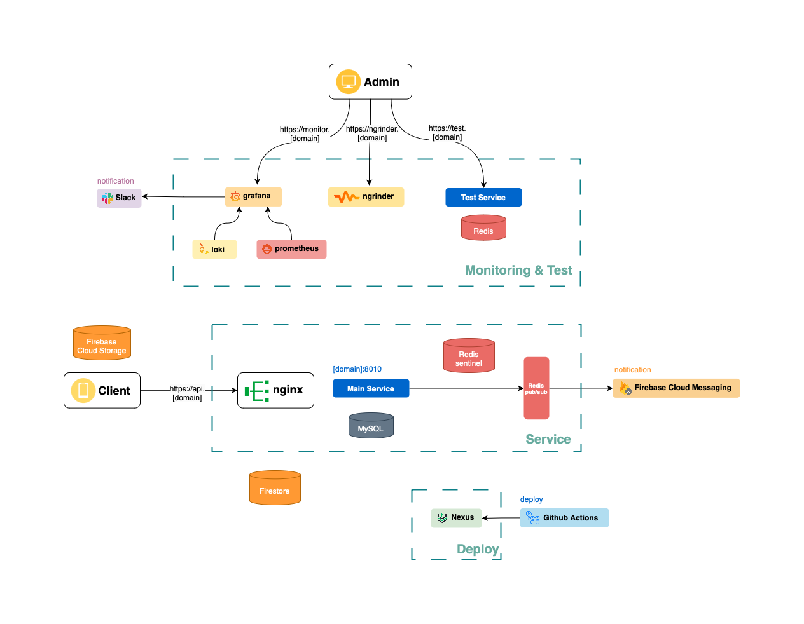

안녕하세요 호남향우회에서 인프라 구현을 맡은 바크콜입니다. 첫번째 게시글이니만큼 에그로그의 서버가 어떻게 변화했는지 정리해보려합니다.  
프로젝트의 프로토 타입을 개발하던 시점 인프라를 처음 담당하게되었었습니다. 때문에 당시 목표는 "CI/CD를 구축하자!" 정도였습니다. 그렇게 설계된 시스템의 구성과 특징을 요약하면 다음과 같습니다.

1. submodule을 활용한 환경변수 관리
2. main 브랜치 push를 트리거로 빌드
3. Docker 컨테이너화
4. AWS Route 53, 로드밸런서를 이용한 도메인 및 SSL 관리
5. nginx 리버스 프록시 적용

이후 두 개의 프로젝트를 거치고 다시 프로젝트를 검토하니 많은 문제를 찾을 수 있었습니다.  
실개발에서 저희 팀의 목표는 `배포`와 `운영` 이었습니다. 이를 달성하기위해서는 테스트와 가용성, 리소스 최적화와 모니터링에 대해 고민해야했습니다.

라벨별로 빌드를 관리하고, 메인 서버를 이중화하여 시스템이 접속 불가가 되는 상황을 막고 무중단 배포를 적용해 downtime 최소화, Elasticsearch를 적용해 full-text 검색 및 ELK 스펙의 로깅, Prometheus와 Grafana 조합의 서버 모니터링 및 알림 서버와 메인 시스템의 분리를 통해 목표를 달성하고자했습니다.
또한 도커 이미지를 private하게 관리하기 위해 Nexus를 통해 도커 사설 레포지토리 및 내부 라이브러리를 구축했는데요, 한 가지 중대한 사항을 놓치고 있다는 걸 깨달았습니다.

바로 `운영`이었습니다. 운영에 있어 중요한건 무엇일까요? 어찌되었든간에 저희 팀의 예산 안에서 최대한의 기능을 제공할 수 있어야한다는 점입니다.
인건비가 제로인 프로젝트에서 지출이 발생하는 곳은 서버입니다. 서버 비용을 절약하기 위해서는 현재 상태를 검토할 필요가 있었습니다.

모든 컨테이너가 비활성 상태일때 서버 상에서 메모리를 점유하고 있는 용량을 확인해보았습니다.

- Elasticsearch : 5.7GB
- Jenkins : 4.5GB
- Spring boot : 0.6 GB
- React : 0.4GB
- Redis : 3MB

제공받은 서버를 사용하고 있는 현재 시점에서는 문제가 되지않았지만 추후 서버를 이전했을때 유지가 불가능한 수준이었습니다. 이를 개선하기 위해 다시 서비스의 예상 사용자를 기준으로 필요한 요구사항을 계산해보았습니다.

- 배포 자동화
  - 현재는 Jenkins를 사용하고 있지만 이미 Docker image 기반의 빌드 방식을 채택하고 있어 추후 서버 이전 시 Github Action으로 대체해 Jenkins의 메모리 사용분을 절약합니다. 해당 사항을 다룬 내용은 다음 게시글에서 다룰 예정입니다.
- 로그 모니터링
  - 고도의 쿼리를 하지 않고 프론트-백 에러 확인용으로 사용 예정이었습니다.
  - ELK -> PLG 스택 변경
    - PLG 스펙의 모니터링 시스템을 구축하고 메트릭을 확인하니 전체 시스템이 1.5GB 미만의 메모리를 점유하고 있었습니다.
    - logback으로 가독성과 로그 모니터링이 용이하도록 커스텀하는 것으로 변경을 마무리했습니다.
- 사용자 1000명 (가정)
  - 게시판 전문 검색(MySQL vs Elasticsearch)
    - 프리티어 환경이라고 가정했습니다. 1GB 메모리 중 75% 이하의 버퍼 풀을 사용한다면 768MB 이하의 버퍼풀을 사용할 수 있게됩니다. 여기서 인덱스의 크기가 10~20%를 차지할때 대략 500MB ~ 1GB를 인덱스 공간으로 사용할 수 있게되는데 때문에 저장가능한 데이터 크기가 5GB 정도라는 것을 유추할 수 있습니다.
      - 전문 검색이 필요한 게시판의 한 row의 데이터 사이즈를 계산하면 대략 130KB 정도인데 이를 통해 대략 4만 row를 저장할 수 있다고 할 수 있습니다.
      - 만약 10%의 이용자가 글을 매일 3개씩 작성한다고 가정한다면 대략 3~4개월 동안 효율을 보장할 수 있으니 서버 스펙에 따라 기간을 변경할 수 있을 것입니다.
  - 캐싱
    - 이제 데이터가 캐싱되는 지점을 살펴보겠습니다.
      - 로그인: refresh 토큰을 캐싱하기 때문에 최대 1000개가 저장됩니다.
      - 게시판
        - 전체 이용자의 50%가 게시판을 매일 이용하며 하루 4개의 게시글을 읽고, 모든 이용자가 2개의 그룹을 운영하며 3개의 그룹에 소속되었다고 가정해보았습니다.
        - 위 가정으로 2000개의 조회와 4000개의 인기 게시글의 정보가 캐싱됩니다.
      - 그룹
        - 위와 동일한 가정을 유지해 2000개의 그룹이 존재한다면, 그룹별로 하나의 초대코드가 존재하므로 2000개의 키가 캐싱됩니다.
      - 이외에 캐싱되는 데이터가 존재하지않으며 위 내용은 일정 주기로 초기화되는 값이기 때문에 종합하면 사용자수의 9배 분량의 키만 존재한다는 것을 알 수 있습니다.
        - key-value 쌍이 현재 기준으로 최대 200Byte를 차지하기 때문에 2~3MB 정도 사용량이라는 것을 추산할 수 있었습니다. 기본적으로 레디스가 3MB를 차지했기 때문에 종합해도 10MB 이하의 공간만 차지하게됩니다.
        - 걱정했던 것보다 사용량이 적어 알림 역시도 redis의 MQ를 활용하기로 결정했습니다.

이러한 의식의 흐름을 거쳐 캐싱와 MQ에 Redis를 사용하고, Elasticsearch와 Jenkins를 제거하는 것으로 75%의 메모리를 절약하게되었습니다. 견물생심이라고 할까요 마음이 넉넉해지니 묘하게 다른 욕심이 생겼습니다. 바로 언제나 호시탐탐 기회를 노리던 고가용성의 시스템 구축이었습니다. 최종적으로는 다음 그림과 같은 시스템 구조를 갖추게되었는데 이 과정은 다음 기회에 또 읊어보도록하겠습니다.

